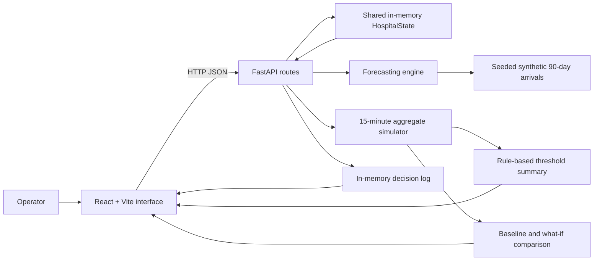

# HospAI
## Predictive Hospital Bottleneck Intelligence

**SYRUS 7.0 Hackathon · Healthcare and Sustainability**  
**Tagline:** Predict Congestion. Optimize Resources. Protect Patient Flow.

> HospAI is a synthetic hospital-operations prototype for exploring how short-horizon arrival forecasting and transparent flow simulations can help teams notice capacity pressure earlier. It is not a clinical system, not connected to a real hospital, and not validated for operational decisions.

## Executive Summary

HospAI brings a generated emergency-arrival forecast, a simplified inpatient and diagnostic queue simulation, threshold-based bottleneck warnings, and scenario comparisons into one interface. Operators can inspect a simulated hospital snapshot, advance its clock in 15-minute steps, and compare illustrative interventions against a baseline. Recommendations are proposals only: approving one records a decision in a temporary demo log and does not execute an intervention.

## Problem Statement

Hospitals coordinate constrained beds, staff, emergency treatment, diagnostics, admissions, transfers, and discharges. A dashboard that only reports current counts can show a problem after a queue or capacity limit has already been reached. Forecasts and scenario analysis can make emerging pressure easier to discuss, but only when data quality, assumptions, uncertainty, and human responsibility are explicit.

HospAI demonstrates that workflow with synthetic data. It does not establish that the modeled effects predict real hospital operations.

## Proposed Solution and Objectives

The prototype generates 90 days of 15-minute emergency-arrival history, trains a scikit-learn model on an earlier chronological segment, evaluates it on a later holdout, and recursively forecasts the next 16 intervals (four hours). A deterministic seeded simulation routes aggregate arrivals through simplified queues and capacity constraints. The same simulation is used to find the first threshold crossing in each monitored department and to compare what-if inputs. The UI displays those outputs alongside the assumptions and a temporary decision log.

Project objectives:

- Demonstrate a coherent synthetic command view for five connected operational areas.
- Keep physical beds, staffed beds, occupancy, boarding, and diagnostic work separate.
- Make short-horizon forecasts and threshold rules inspectable.
- Compare scenario outputs without mutating the current hospital state.
- Keep proposed actions subject to human review and avoid implying clinical validation.

## Dataset Integration & Setup Instructions

### Excel Dataset File Location

The project loads historical operational data directly from an Excel file placed in the root directory:

- **Filename:** `hackathon_hospital_bottleneck_dataset.xlsx`
- **Expected Location:** `HospAI/hackathon_hospital_bottleneck_dataset.xlsx`

```text
HospAI/
├── hackathon_hospital_bottleneck_dataset.xlsx   <-- Required Excel dataset file
├── backend/
│   ├── data_loader.py                            <-- Path resolution & loader module
│   ├── engine.py                                 <-- ML model training & simulation engine
│   ├── main.py                                   <-- FastAPI server & endpoints
│   └── tests/                                    <-- Pytest suite
├── frontend/                                     <-- React + Vite interface
└── README.md
```

### Path Resolution & Error Handling

1. **Path Resolution:** `data_loader.py` dynamically resolves the dataset path relative to `PROJECT_ROOT / "hackathon_hospital_bottleneck_dataset.xlsx"`, enabling the backend to locate the file regardless of working directory.
2. **Environment Override:** You can override the dataset location via the `DATASET_PATH` environment variable.
3. **No Fallback Guarantee:** If `hackathon_hospital_bottleneck_dataset.xlsx` is missing or invalid, the backend raises a `DatasetNotFoundError` and returns HTTP 500 with explicit instructions detailing the required filename and location.
4. **Preservation:** The original Excel file is opened in read-only mode and is never modified or overwritten.

### Dataset Metadata & Quality Analysis

- **Worksheets:** `Hourly_Data` (primary), `Data_Dictionary`, `Refresh_Design`, `Dashboard_Sample`
- **Row Count:** 17,544 rows (2 full years of hourly historical operations)
- **Column Count:** 55 columns
- **Timestamp Range:** `2024-01-01 00:00:00` to `2025-12-31 23:00:00`
- **Data Quality Status:** `VALID`. Exactly 4 rows at the end of the time series contain NaN values for 4-hour forward target columns (`actual_arrivals_next_4h`), which are cleanly handled during train/test splitting.


## Core Features

- Seeded synthetic arrival history with a chronological train/test split.
- Recursive 4-hour, 15-minute arrival forecast and normal, monsoon, flu, and synthetic outbreak multipliers.
- One in-memory hospital state shared by status, simulation advance, and reset endpoints.
- Patient-flow simulation with aggregate ED, ICU, Ward, Laboratory, and Radiology counts.
- Threshold-crossing warnings with severity, interval-to-onset, metric, threshold, and reason.
- Scenario comparison for arrival, season, ICU staffed-bed, discharge, staff-equivalent, and diagnostic throughput adjustments.
- Simulated recommendation proposals with modeled score changes and human approval flags.
- Five-page React interface with interactive Recharts visualizations and responsive layouts.
- +15-minute advance, refresh-without-advance, and reset-demo controls.

## Application Pages

### 1. Operations Dashboard

- **Purpose:** Current synthetic command view.
- **Displayed data:** Inpatient staffed-bed occupancy, available staffed beds, ED queue count, simulated bottleneck count, five department snapshots, warnings, and the next four hours of ED arrivals.
- **Controls:** View Predictions, Open Scenario Lab, Review Resources, Refresh, +15 min, Reset.
- **Interactions:** Navigation changes the main view; refresh fetches a new snapshot; advance changes the backend clock and simulation state.
- **Endpoints:** `/api/snapshot`, `/api/advance?season=...`, `/api/reset`.
- **Expected output:** A synthetic operational overview, not a live hospital status report. ED waiting is explicitly a patient count, not minutes.

### 2. Resource & Capacity Management

- **Purpose:** Monitor inpatient bed capacity, illustrative staffing allocation, and diagnostic queues together.
- **Displayed data:** Physical, staffed, occupied, and available ICU/Ward beds; doctors and nurses from fixed synthetic demo assumptions; Lab and Radiology pending/completed/request and per-15-minute processing counts; bottleneck-aware projected occupancy.
- **Controls:** Select all inpatient departments, ICU, or Ward; select a donut segment to highlight its summary; Evaluate Resource Reallocation opens the Scenario Lab.
- **Interactions:** Bed donut and summary update with the selected department. Tooltips identify bed counts and percentages. Diagnostic workloads remain separate from beds.
- **Endpoints:** `/api/status`, `/api/bottlenecks`; Evaluate Resource Reallocation navigates to the scenario controls that call `/api/simulate` and `/api/recommend`.
- **Expected output:** An internally consistent synthetic snapshot. Staffing figures are labeled assumptions, not roster data. Department allocation is illustrative and does not provide workload-derived staff shortfalls.

### 3. Bottleneck Prediction

- **Purpose:** Inspect the four-hour synthetic demand outlook and threshold-crossing risks.
- **Displayed data:** Expected arrivals, model and baseline MAE, holdout interval count, current department load, simulated peak values, first threshold-crossing timing, severity, and rule explanation.
- **Controls:** Season selector: Normal, Monsoon, Flu, and Outbreak (synthetic stress case).
- **Interactions:** Season changes refetch forecasts and simulated risks. The line/area time series uses readable local clock labels and hover details.
- **Endpoints:** `/api/model`, `/api/forecast?season=...`, `/api/bottlenecks?season=...`.
- **Expected output:** 16 forecast intervals and aggregate four-hour simulated risks. Risk thresholds are rule-based, not calibrated probability estimates or SHAP explanations.

### 4. Patient Flow

- **Purpose:** Show aggregate flow branches and diagnostic dependencies.
- **Displayed data:** Forecast arrivals, ED treatment and waiting counts, ICU/Ward boarding, diagnostic queues, cumulative demo discharges, and simulated peak ED queue.
- **Controls:** Highlight all departments or an individual department.
- **Interactions:** A branching diagram separates the Emergency outcomes (discharge, ICU, Ward) from parallel Laboratory and Radiology dependencies.
- **Endpoints:** `/api/status`, `/api/forecast`, `/api/bottlenecks`.
- **Expected output:** Aggregate counts only. The backend has no individual patient records or exact pathway-level diagnostic links.

### 5. AI Recommendations & Scenario Lab

- **Purpose:** Compare selected scenario inputs with a baseline and inspect illustrative actions.
- **Displayed data:** Scenario inputs, peak ICU/Ward boarding, ED waiting, Lab/Radiology queues, a baseline/scenario ICU-boarding chart, feasibility warning thresholds, proposal score, modeled outcomes, and the decision log.
- **Controls:** Season; arrival multiplier; ICU staffed-bed delta; discharge uplift; staff delta; Lab and Radiology processing deltas; Run Simulation; Reset Scenario; Approve for demo log; Reject.
- **Interactions:** Simulation runs do not mutate shared live demo state. Changed controls mark prior results stale. Approval/rejection writes a timestamped in-memory record with snapshot reference; it does not execute a clinical or operational action.
- **Endpoints:** `/api/simulate`, `/api/recommend`, `/api/decision`, `/api/decisions`.
- **Expected output:** Deterministic synthetic baseline and scenario results using the same forecast demand and random seed. Recommendations are modeled proposals and require feasibility verification and human approval.

## Complete System Workflow

Synthetic history and current state → ED arrival forecast → aggregate patient-flow simulation → department threshold detection → downstream queue and capacity view → user-selected what-if simulation → deterministic proposals → human approval/rejection recorded in demo log.

## System Architecture



## Technology Stack

Implemented in this repository:

- **Frontend:** React 18, Vite 6, Recharts 2, lucide-react.
- **Backend:** Python, FastAPI, Pydantic 2, Uvicorn.
- **Forecast/data processing:** NumPy, pandas, scikit-learn `HistGradientBoostingRegressor`.
- **Tests:** pytest and the engine regression tests under `backend/tests`.
- **API inspection:** FastAPI/OpenAPI UI at `/docs`.

There is no database, real hospital integration, LLM recommendation service, authentication provider, or deployed SHAP explanation in the current implementation. These are not implemented technologies.

## Synthetic Dataset

- **Source:** Generated in `backend/engine.py`; no hospital records are loaded.
- **Generation:** NumPy random generator seeded with 42; 90 days at 96 intervals per day, beginning 2026-07-01.
- **Interval and fields:** 15-minute interval rows with timestamp, hour, weekday, month, generated season, and arrivals.
- **Assumptions:** Poisson arrival counts with hand-set time-of-day, weekday/weekend, and monsoon factors.
- **Generated artifact:** The model-artifact function writes `backend/data/historical_arrivals.csv` when first called; it is generated output, not a committed source dataset requirement.
- **Limitations:** Synthetic distributions and factors are not estimated from a hospital population and must not be treated as representative clinical or operational data.

## Machine-Learning Model

- **Target:** ED arrivals per 15-minute interval.
- **Features:** Hour, weekday, month, season code, lagged arrivals at 1, 4, and 96 intervals, and a 4-interval rolling mean.
- **Training:** Seeded 90-day synthetic history; first 80% of the usable chronological rows train the model and the final 20% form the holdout.
- **Model:** scikit-learn `HistGradientBoostingRegressor` with fixed configuration and random state 42.
- **Baseline:** Mean arrival rate grouped by hour and weekday, with training-set mean fallback.
- **Evaluation:** Mean absolute error (MAE), returned by `GET /api/model` as `model_mae`, `baseline_mae`, and `test_intervals`. Exact numbers are computed at runtime and are deliberately not hard-coded in this document.
- **Forecast:** 16 recursive 15-minute intervals. The API applies fixed scenario multipliers: normal 1.00, monsoon 1.15, flu 1.30, outbreak 1.50. The outbreak case is a synthetic stress assumption.
- **Limitations:** No uncertainty intervals, external regressors, live retraining, or external validation. A synthetic holdout metric is not evidence of real-world predictive performance.

## Hospital Simulation Engine

- One in-memory `HospitalState` is the source of current demo status.
- Each simulation interval is 15 minutes; standard scenario horizon is four hours (16 intervals).
- Arrivals are sampled from a Poisson distribution using expected forecast demand and a deterministic seed.
- Up to eight waiting ED patients enter treatment spaces per interval; up to seven treatment patients complete ED treatment.
- Completed ED treatment routes 8% of cases to ICU, 22% of the remainder to Ward, and the remainder to discharge, using seeded random draws.
- Occupied ICU/Ward beds discharge using binomial rates 1.8% and 2.8% per interval, plus the scenario discharge uplift.
- Boarding patients transfer into staffed beds only when capacity permits. Physical and staffed capacities remain distinct.
- Lab/Radiology requests are sampled from ED service counts; default processing capacity is 9 tests and 4 scans per 15 minutes, adjusted by scenario controls.
- Assertions check patient conservation and staffed/physical bed bounds during simulation.
- The simulator is an aggregate deterministic demonstration, not discrete-event patient care software.

## Bottleneck Detection

The simulator summary finds the first 15-minute interval in which a metric meets a fixed threshold:

| Department | Metric | Threshold |
|---|---|---:|
| ICU | Boarding patients | 1 |
| Ward | Boarding patients | 2 |
| Emergency | Waiting patients | 15 |
| Laboratory | Pending tests | 20 |
| Radiology | Pending scans | 12 |

Onset time is `(interval index + 1) × 15` minutes. Severity is `HIGH` at or above twice the threshold and otherwise `MEDIUM`. Reasons report the projected metric and threshold. These are simple operational rules, not predicted probabilities, clinical severity, or SHAP values.

## Seasonal Intelligence

Normal, Monsoon, Flu, and Outbreak options are supported by forecast, bottleneck, scenario, and recommendation requests. The fixed multipliers are documented above. They are assumptions, not learned seasonal effects. The outbreak option is a synthetic stress case, not an epidemiologic forecast.

## What-If Simulation

`POST /api/simulate` accepts season, arrival multiplier, ICU staffed-bed delta, discharge uplift, staff delta, Laboratory processing delta, and Radiology processing delta. It copies the current state, uses the same demand path and deterministic seed for baseline and scenario, and returns both timelines, metrics, and the source `snapshot_reference`. The shared current state is not changed by this endpoint. Scenario bed/staff values remain subject to physical and occupied-bed constraints. In this synthetic engine, each two staff-delta units adjust simulated ICU staffed-bed capacity by one bed (integer conversion); this is not a real staffing roster model. Diagnostics capacities may reach zero, in which case queues accumulate.

## Recommendations and Human Review

`POST /api/recommend` compares a user-selected scenario with three deterministic proposals: expedite eligible discharges, activate two staffed ICU beds when feasible, and expand Laboratory throughput. It calculates a weighted score from modeled ICU boarding, Ward boarding, and Lab pending changes. Each proposal is illustrative, carries feasibility conditions, and requires human approval. Approve/reject records a decision only; there is no automated action, LLM agent, clinical workflow, or persistent audit store.

## Global Simulation Controls

- **Refresh:** Fetches one snapshot containing status, forecast, bottleneck simulation, model metrics, and decisions; does not advance simulated time.
- **+15 min:** Calls `/api/advance?season=...`; backend simulates one 15-minute interval using the selected seasonal demand multiplier, updates the shared state, and increments the simulated clock. The UI refreshes the other views and clears scenario results tied to the prior snapshot.
- **Reset:** Calls `/api/reset`; restores the initial `HospitalState`, clock, and in-memory decisions, then resets local scenario controls and reloads data.
- **Run Simulation:** Compares a copied current state with the selected scenario; does not mutate the shared state.
- **Approve/Reject:** Records a timestamped demo decision with optional scenario reference. It does not carry out the proposal.

## Installation on Windows

Prerequisites: a supported Python installation satisfying `backend/requirements.txt`, Node.js/npm, and PowerShell. The backend dependencies include packages that may need wheels compatible with the local Python version.

Backend terminal:

```powershell
cd backend
py -m venv .venv
.venv\Scripts\Activate.ps1
pip install -r requirements.txt
uvicorn main:app --reload
```

If PowerShell blocks activation for the current terminal, run `Set-ExecutionPolicy -Scope Process -ExecutionPolicy RemoteSigned`, then activate again. Alternatively, invoke `.venv\Scripts\python.exe -m uvicorn main:app --reload` without activating.

Frontend terminal:

```powershell
cd frontend
npm install
npm run dev
```

Open the Vite URL (normally `http://localhost:5173`). API docs: `http://localhost:8000/docs`; OpenAPI JSON: `http://localhost:8000/openapi.json`.

Optional frontend API override: set `VITE_API_URL` to the FastAPI base URL, for example `http://localhost:8000`, before starting Vite. The default is `http://localhost:8000`. CORS currently permits localhost and 127.0.0.1 on ports 5173 and 5174 for local development.

## Repository Structure

```text
README.md
PROJECT_STATUS.md
backend/
	engine.py                 Synthetic history, forecast, state, simulation, risk rules
	main.py                   FastAPI routes and in-memory state/decisions
	requirements.txt          Python backend dependencies
	tests/test_engine.py      Engine regression tests
	tests/test_api.py         FastAPI snapshot/control regression tests
frontend/
	index.html                Vite document shell and title
	package.json              Frontend dependencies and scripts
	src/main.jsx              Five-page React UI, charts, API calls and controls
	src/style.css             Dashboard layout and responsive design
```

`backend/data/historical_arrivals.csv` is generated on first model initialization and may appear at runtime.

## API Reference

All endpoints are under `/api`. FastAPI publishes the exact live schema at `/docs` and `/openapi.json`.

| Method and route | Purpose |
|---|---|
| `GET /api/health` | Health and synthetic mode flag. |
| `GET /api/snapshot?season=normal` | Capture state and decisions once, then return matching status, forecast, bottleneck timeline/metrics, model metrics, and snapshot reference. |
| `GET /api/status` | Current state, simulated timestamp, departments, resource capacity/staff/diagnostic snapshot, patient count and demo discharges. |
| `GET /api/model` | Model name, synthetic data metadata, model and baseline MAE, holdout size. |
| `GET /api/forecast?season=normal` | 16 forecast intervals, four-hour total, season and synthetic flag. Season accepts `normal`, `monsoon`, `flu`, `outbreak`. |
| `GET /api/bottlenecks?season=normal` | Threshold warnings, 16-step aggregate simulation timeline/metrics, snapshot reference. |
| `POST /api/simulate` | Baseline and what-if timelines and risk metrics from a copied state. |
| `POST /api/recommend` | Deterministic proposals and modeled score/outcome from the submitted scenario. |
| `POST /api/decision` | Record a demo approval or rejection. |
| `GET /api/decisions` | Return in-memory demo decisions. |
| `POST /api/advance?season=normal` | Simulate one step using the selected season and advance the shared state clock 15 minutes. |
| `POST /api/reset` | Restore the initial state and clear decisions. |

Example scenario payload:

```json
{
	"season": "flu",
	"arrival_multiplier": 1.2,
	"bed_delta": 1,
	"staff_delta": 0,
	"discharge_extra": 1,
	"lab_delta": 2,
	"radiology_delta": 0
}
```

Scenario bounds are validated by Pydantic: arrival multiplier 0.25–3; staff delta −8–8; ICU bed delta −10–4; discharge uplift 0–3; Lab delta −8–8; Radiology delta −3–5. Decision payload requires `action` and `approved`; `operator` and `scenario_reference` are optional.

Important response shapes:

- Status returns `departments` plus `resources.beds`, `resources.staffing`, and `resources.diagnostics`. Staff totals and department allocation include a `synthetic_demo_assumption` source marker.
- Forecast returns `{horizon_hours, season, expected_total_arrivals, intervals, synthetic}`; each interval has ISO timestamp and expected arrival count.
- Bottleneck entries return department, severity, minutes-to-onset, metric, first observed value, threshold, and reason.
- Simulation returns the validated request, `baseline` and `scenario` objects containing `timeline`, `metrics`, and `bottlenecks`.
- Decision entries return ID, action, approval, operator, optional scenario reference, and UTC timestamp.
- Snapshot response groups `status`, `forecast`, `bottlenecks`, `model`, and `decisions` under one `snapshot_reference`, giving the UI a coherent captured clock step.

## Testing and Validation

From the repository root, run:

```powershell
cd backend
python -m pytest -q
```

The engine suite checks forecast shape/non-negativity, conservation/capacity bounds, determinism, model metrics, resource capacity separation, and safe negative ICU-bed deltas. The API suite checks coherent snapshot fields, season request behavior, exactly 15-minute advancement, reset, and decision references. Frontend production compilation:

```powershell
cd frontend
npm run build
```

Run API checks against a running backend separately through `/docs` or an HTTP client. See [PROJECT_STATUS.md](PROJECT_STATUS.md) for the latest environment-specific verification evidence; test outcomes are not inferred from the presence of test files.

## Known Limitations

- All patients, arrivals, staffing totals, allocations, capacities, and queues are synthetic.
- No clinical validation, uncertainty calibration, or external model evaluation exists.
- Only ED arrivals are forecast by ML; downstream load is simulated from fixed assumptions.
- Staff totals and department allocation are static demonstration assumptions, not live rosters or assessed staffing gaps.
- The simulator uses aggregate counts and simplified arrival/routing/discharge/throughput rules.
- There are no individual patient journeys, measured wait times, real transfers, or hospital-system integrations.
- Decision records are held in memory and disappear on restart/reset.
- No authentication, authorization, persistence, privacy/security controls for real data, or production deployment setup exists.
- Scenario recommendations are simple weighted deterministic proposals, not an AI agent; approval does not execute work.

## Future Enhancements

Potential next work, not currently implemented: authenticated roles and durable audit storage; privacy/security assessment; hospital data interfaces; calibration using governed operational data; uncertainty-aware forecasts and backtesting; explainability validated for the selected model; validated patient-flow model; configurable thresholds; service monitoring, deployment hardening, and accessibility/usability studies with intended users.

## Hackathon Demonstration Guide (3–5 minutes)

1. Start the API and Vite development server; show that the page is labeled synthetic and point out the simulated clock.
2. Use Operations Dashboard to review department queues, current staffed-bed occupancy, and any rule-based warnings.
3. Open Bottleneck Prediction; compare Normal and Flu or Outbreak, inspect the 4-hour forecast and read the explicit threshold definitions.
4. Open Resource & Capacity Management; filter to ICU, compare physical/staffed/occupied/available beds, and inspect separately labeled staff assumptions and diagnostic queues.
5. Open the Scenario Lab; raise demand or alter bed/discharge/diagnostic assumptions, run the model, compare baseline to scenario, and explain that it did not mutate current state.
6. Approve or reject a proposal to demonstrate human review logging, then show that approval is not execution.
7. Advance +15 minutes, show the new shared snapshot and refreshed warnings, then Reset to restore the initial demo state.

## Team Contributions

## Team Quad Ninjas

Built with teamwork for **SYRUS 7.0 Hackathon — Healthcare & Sustainability Track**.

- **Roshan Manjal** , **Rishi Gogia** , **Chirfag Nagra** ,**Lakhan Karani**

Replace these placeholders with the team's actual names and contributions before submission; no member details were available in the repository during this review.

## License and Acknowledgements

No license file or verified license declaration is present in the repository. Do not redistribute or present a license grant until the project owners choose and add one. Acknowledge SYRUS 7.0 and any external datasets or assets actually incorporated in a final submission.
